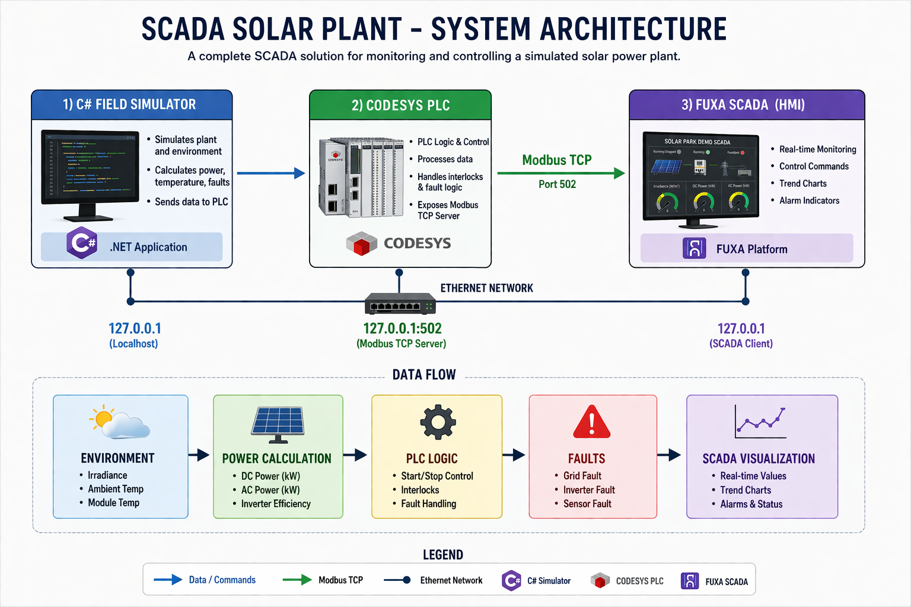
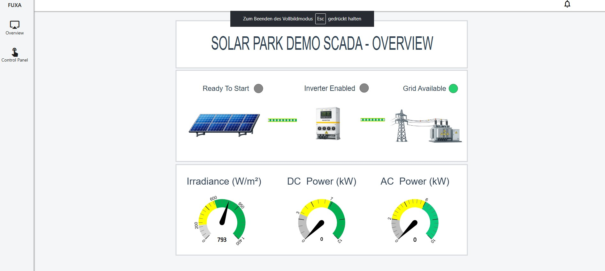
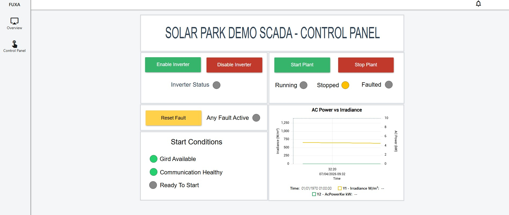

# ☀️ SCADA Solar Plant Simulation
A complete SCADA system for a simulated solar plant using **CODESYS (PLC)**, **C# Simulator**, and
**FUXA (HMI/SCADA)** with **Modbus TCP communication**.

## 📌 Overview

This project simulates a solar power plant and demonstrates a full SCADA workflow:

- Data generation using a C# simulation
- PLC logic processing in CODESYS
- Communication via Modbus TCP
- Visualization and control using FUXA SCADA

The system allows real-time monitoring and control of the plant, including power
production, environmental conditions, and system states.

## 🏗️ System Architecture

**Data Flow:**
C# Simulator -> CODESYS PLC -> Modbus TCP -> FUXA SCADA

**Command Flow:**
FUXA SCADA -> Modbus TCP -> CODESYS PLC -> C# Simulator

## ⚙️ Features

- Real-time monitoring (AC Power, DC Power, Irradiance, Temperature)
- Start / Stop Plant control
- Enable / Disable Inverter
- Fault simulation (Grid, Inverter, Sensor)
- Live trend chart visualization ( Irradiance vs AcPower)
- Energy calculation (daily & total)

## 🖥️ SCADA Screens

### Overview Page

### Control Panel

## 📐 Simulation Model

The system simulates realistic solar plant behavior using the following equations:

- Irradiance(W/m²) = max(0, sin((hour - 6) / 12 × π)) × 1000  
- Ambient Temperature (°C) = 15 + (Irradiance / 1000) × 15  
- Module Temperature (°C) = Ambient Temperature + 5  

- DC Power (kW) = 7.36 × (Irradiance / 1000) × Temperature Factor  
- AC Power (kW) = min(DC Power × 0.98, 5.0)  

- Energy (kWh) = Power × Time  

## 🧩 System Logic
The plant operates only when all conditions are satisfied:

- Plant Enabled  
- Inverter Enabled  
- Grid Available  
- Inverter Available  
- No Active Faults  

Otherwise, the system transitions to **Stopped** or **Faulted** state.

## 🎥 Demo

▶️ [Start/Stop Demo](https://www.youtube.com/watch?v=MRMWtT-8_YQ)  
▶️ [Full-Flow Demo](https://www.youtube.com/watch?v=txK043ApfFE)  
▶️ [Fault-Trigger Demo](https://www.youtube.com/watch?v=tMSkhBcMWJE)
▶️ [Fault-Acknowledged Demo](https://www.youtube.com/watch?v=ith3j_CxXHw)

## 🧰 Technologies Used

- **CODESYS** (V3.5 SP21 Patch 5, CODESYS Control Win V3 - x64 Version 3.5.21.50)
- **C# (.NET 8, Visual Studio 2022)**
- **FUXA SCADA** (Version 1.3.0-2738 powered by frangoteam)
- **Modbus TCP** (Nmodbus v3.0.81)

## 📁 Project Structure

SCADA-Solar-Plant/
│
├── codesys/
├── csharp-simulator/
├── fuxa/
├── screenshots/
└── README.md

## 🧠 Challenges & Solutions

- Control signals were resetting unexpectedly → fixed PLC logic handling  
- Modbus communication setup between PLC and SCADA  
- Data scaling between PLC and SCADA (WORD → REAL conversion)  

## 🚀 Future Improvements (TBD)

- Alarm management system  
- Historical data storage (Historian)
- Database (SQL)   
- Web-based deployment
- Adding OPC UA Communication 
- MQTT   

This project demonstrates end-to-end SCADA engineering skills including simulation design, PLC
programming, industrial communication, and HMI development.